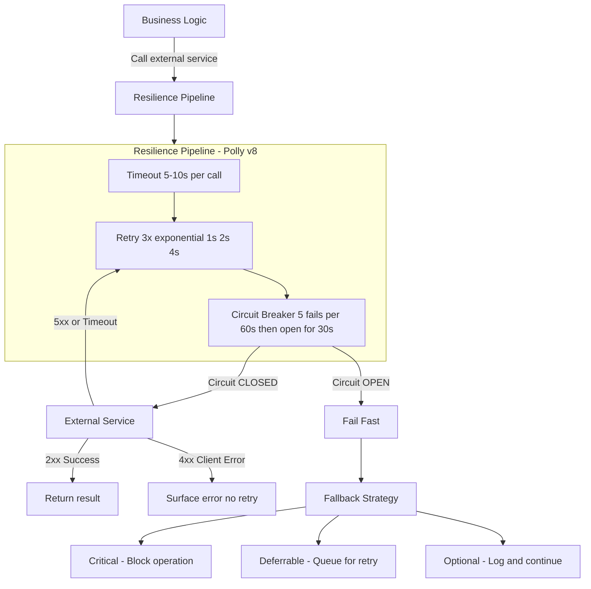
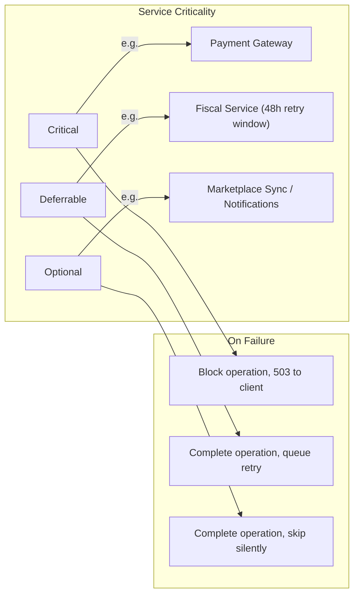
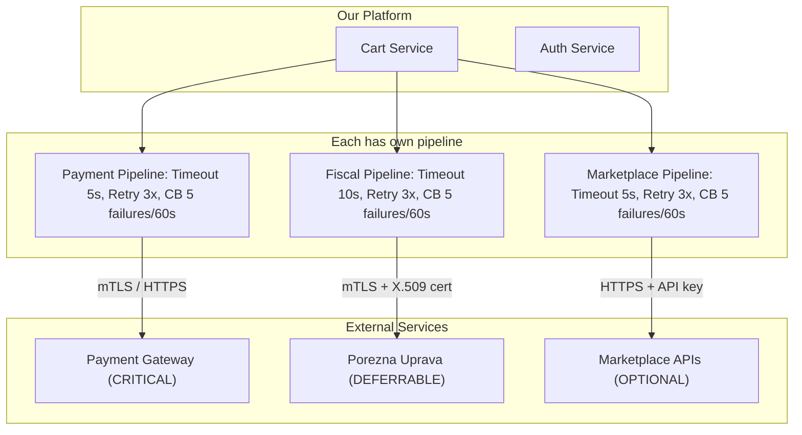

# External Service Integration Pattern

## Generic Resilience Flow

```mermaid
flowchart TD
    BL[Business Logic] -->|Call external service| RP[Resilience Pipeline]

    subgraph RP_DETAIL[Resilience Pipeline - Polly v8]
        direction TB
        TO[Timeout 5-10s per call]
        RT[Retry 3x exponential 1s 2s 4s]
        CB[Circuit Breaker 5 fails per 60s then open for 30s]
        TO --> RT --> CB
    end

    RP --> RP_DETAIL
    CB -->|Circuit CLOSED| EXT[External Service]
    CB -->|Circuit OPEN| FF[Fail Fast]

    EXT -->|2xx Success| OK[Return result]
    EXT -->|4xx Client Error| ERR[Surface error no retry]
    EXT -->|5xx or Timeout| RT

    FF --> FALLBACK[Fallback Strategy]

    FALLBACK --> CRIT[Critical - Block operation]
    FALLBACK --> DEFER[Deferrable - Queue for retry]
    FALLBACK --> OPT[Optional - Log and continue]
```

## Failure Classification

```mermaid
flowchart LR
    subgraph Classification[Service Criticality]
        direction TB
        C[Critical] -->|e.g.| PAY[Payment Gateway]
        D[Deferrable] -->|e.g.| FISC["Fiscal Service (48h retry window)"]
        O[Optional] -->|e.g.| MKT["Marketplace Sync / Notifications"]
    end

    subgraph Behavior[On Failure]
        direction TB
        B1["Block operation, 503 to client"]
        B2["Complete operation, queue retry"]
        B3["Complete operation, skip silently"]
    end

    C --> B1
    D --> B2
    O --> B3
```

## Integration Architecture

```mermaid
flowchart TB
    subgraph Internal[Our Platform]
        CS[Cart Service]
        AS[Auth Service]
    end

    subgraph Resilience[Each has own pipeline]
        P1["Payment Pipeline: Timeout 5s, Retry 3x, CB 5 failures/60s"]
        P2["Fiscal Pipeline: Timeout 10s, Retry 3x, CB 5 failures/60s"]
        P3["Marketplace Pipeline: Timeout 5s, Retry 3x, CB 5 failures/60s"]
    end

    subgraph External[External Services]
        PAY["Payment Gateway (CRITICAL)"]
        FISC["Porezna Uprava (DEFERRABLE)"]
        MKT["Marketplace APIs (OPTIONAL)"]
    end

    CS --> P1 -->|mTLS / HTTPS| PAY
    CS --> P2 -->|mTLS + X.509 cert| FISC
    CS --> P3 -->|HTTPS + API key| MKT
```
