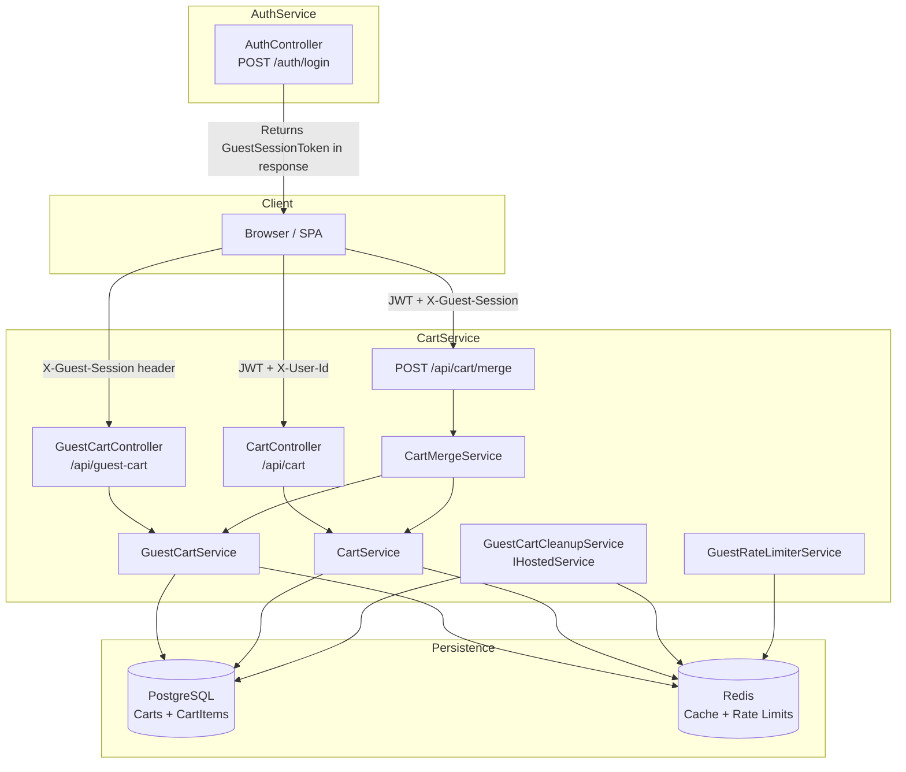

# Design Document: Guest Cart Persistence

## Overview

This design extends the existing CartService to support anonymous (guest) shoppers who can add items to a cart without authentication. A server-generated session token (UUID v4) identifies the guest cart and is persisted client-side in browser local storage. When the guest logs in, a merge operation combines guest cart items into the authenticated user's cart with conflict resolution and stock validation.

The design follows the existing architectural patterns: EF Core + PostgreSQL for persistence, Redis (StackExchange.Redis with Polly circuit breaker) for caching, and the same cache-aside strategy already used for authenticated carts.

### Key Design Decisions

1. **Extend existing `Cart` model** with a nullable `GuestSessionToken` field rather than creating a separate table. This reuses the existing `CartItem` structure and persistence logic.
2. **Separate `GuestCartController`** at `/api/guest-cart` with `[AllowAnonymous]` to avoid polluting the existing `[Authorize]`-protected `CartController`.
3. **Merge endpoint on `CartController`** at `POST /api/cart/merge` since it requires authentication (JWT) to identify the target user.
4. **Rate limiting via Redis** using a sliding window counter per IP address for guest session creation.
5. **Background cleanup via `IHostedService`** running on a timer to batch-delete expired guest carts.

## Architecture



### Request Flows

**Guest Add Item:**
1. Client sends `POST /api/guest-cart/items` with `X-Guest-Session: <token>` (or empty for new session)
2. `GuestCartController` validates token format or generates new UUID v4
3. `GuestCartService` checks rate limit (if new session), verifies inventory, persists item
4. Returns cart with `guestSessionToken` in response body

**Cart Merge on Login:**
1. Client sends `POST /auth/login` with `X-Guest-Session: <token>` header
2. AuthService returns `LoginResponse` with `GuestSessionToken` field
3. Client sends `POST /api/cart/merge` with JWT Authorization + `X-Guest-Session` header
4. `CartMergeService` loads guest cart, loads/creates auth cart, merges with conflict resolution
5. Deletes guest cart, returns merged cart with adjustment summary

## Components and Interfaces

### New Components

#### 1. GuestCartController

```csharp
[ApiController]
[Route("api/guest-cart")]
[AllowAnonymous]
public class GuestCartController : ControllerBase
{
    // POST /api/guest-cart/items — Add item (creates session if needed)
    // GET /api/guest-cart — Get guest cart
    // PUT /api/guest-cart/items/{itemId} — Update item quantity
    // DELETE /api/guest-cart/items/{itemId} — Remove item
}
```

#### 2. IGuestCartService

```csharp
public interface IGuestCartService
{
    Task<GuestCartResult> CreateSession();
    Task<GuestCartResult> GetCart(Guid guestSessionToken);
    Task<GuestCartResult> AddItem(Guid guestSessionToken, Guid productId, int quantity);
    Task<GuestCartResult> UpdateItem(Guid guestSessionToken, Guid itemId, int quantity);
    Task<GuestCartResult> RemoveItem(Guid guestSessionToken, Guid itemId);
    Task<Cart?> GetCartEntity(Guid guestSessionToken);
    Task DeleteGuestCart(Guid guestSessionToken);
}
```

#### 3. ICartMergeService

```csharp
public interface ICartMergeService
{
    Task<MergeResult> MergeGuestCart(Guid userId, Guid guestSessionToken);
}
```

#### 4. IGuestRateLimiterService

```csharp
public interface IGuestRateLimiterService
{
    /// <summary>
    /// Checks if the IP can create a new guest session (max 10 per 60 min sliding window).
    /// </summary>
    Task<GuestRateLimitResult> CheckSessionCreationLimit(string ipAddress);
}

public record GuestRateLimitResult(bool IsAllowed, int? RetryAfterSeconds = null);
```

#### 5. GuestCartCleanupService (IHostedService)

```csharp
public class GuestCartCleanupService : BackgroundService
{
    // Runs every 60 minutes
    // Queries for guest carts where UpdatedAt < UtcNow - 10 days
    // Deletes in batches of 100
    // Logs failures per cart and continues
}
```

### Modified Components

#### AuthController (AuthService)

- `POST /auth/login`: Read `X-Guest-Session` header, include `GuestSessionToken` field in `LoginResponse` if present and valid UUID.

#### LoginResponse (AuthService)

```csharp
// Extended with optional field
public record LoginResponse(
    string AccessToken,
    string RefreshToken,
    int ExpiresIn,
    string? GuestSessionToken = null  // Included when X-Guest-Session header present
);
```

### DTOs

```csharp
// Response wrapper for guest cart operations
public record GuestCartResponse
{
    public Guid GuestSessionToken { get; init; }
    public Guid CartId { get; init; }
    public List<CartItemDto> Items { get; init; }
    public MoneyDto TotalPrice { get; init; }
    public DateTime CreatedAt { get; init; }
    public DateTime UpdatedAt { get; init; }
}

// Merge result
public record MergeResponse
{
    public Guid CartId { get; init; }
    public Guid UserId { get; init; }
    public List<CartItemDto> Items { get; init; }
    public MoneyDto TotalPrice { get; init; }
    public List<MergeAdjustment>? Adjustments { get; init; }
    public bool StockValidationSkipped { get; init; }
}

public record MergeAdjustment(
    Guid ProductId,
    string ProductName,
    int OriginalGuestQuantity,
    int OriginalAuthQuantity,
    int MergedQuantity,
    string Reason  // "conflict_resolution" | "stock_limit"
);
```

## Data Models

### Cart Entity (Extended)

```csharp
public class Cart
{
    public Guid Id { get; set; }
    public Guid UserId { get; set; }                    // Remains for authenticated carts
    public Guid? GuestSessionToken { get; set; }        // NEW: null for authenticated carts
    public DateTime CreatedAt { get; set; }
    public DateTime UpdatedAt { get; set; }

    public virtual ICollection<CartItem> Items { get; set; } = new List<CartItem>();
}
```

**Design rationale:** Using a nullable `GuestSessionToken` on the existing `Cart` table keeps the data model simple. A guest cart has `UserId = Guid.Empty` and a non-null `GuestSessionToken`. An authenticated cart has a real `UserId` and `GuestSessionToken = null`.

### Database Migration

```sql
ALTER TABLE "Carts" ADD COLUMN "GuestSessionToken" uuid NULL;

CREATE UNIQUE INDEX "IX_Carts_GuestSessionToken" 
    ON "Carts" ("GuestSessionToken") 
    WHERE "GuestSessionToken" IS NOT NULL;

CREATE INDEX "IX_Carts_GuestSessionToken_UpdatedAt"
    ON "Carts" ("UpdatedAt")
    WHERE "GuestSessionToken" IS NOT NULL;
```

- **Unique filtered index** on `GuestSessionToken` ensures one cart per token (Requirement 9.1).
- **Filtered index on `UpdatedAt`** for efficient expired cart lookups by the cleanup service.

### Redis Key Strategies

| Key Pattern | Value | TTL | Purpose |
|---|---|---|---|
| `guest_cart:{sessionToken}` | Serialized cart JSON | 10 days | Cache-aside for guest carts |
| `guest_rate:{ip}` | Sorted set of timestamps | 60 min | Sliding window rate limit |
| `cart:{userId}` | Serialized cart JSON | 24 hours | Existing authenticated cart cache |

### Rate Limiting Implementation

Uses a Redis sorted set with timestamps as scores:
1. `ZREMRANGEBYSCORE guest_rate:{ip} -inf {now - 60min}` — remove expired entries
2. `ZCARD guest_rate:{ip}` — count remaining entries
3. If count >= 10, reject with 429
4. Otherwise: `ZADD guest_rate:{ip} {now} {now}` and `EXPIRE guest_rate:{ip} 3600`

### Cart Merge Algorithm

```
function merge(guestCart, authCart):
    mergedItems = copy(authCart.items)
    adjustments = []
    
    for each guestItem in guestCart.items:
        if mergedItems.count >= 50:
            break (return partial merge indication)
        
        existingItem = mergedItems.find(i => i.productId == guestItem.productId)
        
        if existingItem is null:
            // Guest-only item: add to auth cart
            mergedItems.add(guestItem)
        else:
            // Conflict: take higher quantity, cap at 9999
            mergedQuantity = min(max(guestItem.quantity, existingItem.quantity), 9999)
            if mergedQuantity != guestItem.quantity AND mergedQuantity != existingItem.quantity:
                adjustments.add(adjustment)
            existingItem.quantity = mergedQuantity
    
    // Stock validation pass
    for each item in mergedItems:
        try:
            available = checkAvailability(item.productId, item.quantity)
        catch InventoryServiceFailure:
            skipStockValidation = true
            break
        
        if available < item.quantity:
            item.quantity = available  (or remove if 0)
            adjustments.add(stock_limit adjustment)
    
    return mergedCart with adjustments
```


## Correctness Properties

*A property is a characteristic or behavior that should hold true across all valid executions of a system — essentially, a formal statement about what the system should do. Properties serve as the bridge between human-readable specifications and machine-verifiable correctness guarantees.*

### Property 1: Guest cart add/retrieve round-trip

*For any* valid product and quantity within stock limits, adding that item to a guest cart and then retrieving the cart SHALL return a cart containing that item with the same product ID, product name, unit price, and quantity.

**Validates: Requirements 1.3, 2.1, 3.3**

### Property 2: Guest session token format and presence

*For any* guest cart operation response, the `guestSessionToken` field SHALL be present and SHALL be a valid UUID v4 string.

**Validates: Requirements 1.2, 3.1**

### Property 3: Invalid token rejection

*For any* string that is not a valid UUID v4 format, sending it as the `X-Guest-Session` header to any guest cart endpoint or the merge endpoint SHALL result in HTTP 400.

**Validates: Requirements 1.4, 7.3, 8.4**

### Property 4: Update quantity correctness

*For any* guest cart containing an item and *for any* valid quantity (1–999), updating that item's quantity SHALL result in the item having exactly the new quantity when the cart is retrieved.

**Validates: Requirements 2.2**

### Property 5: Remove item correctness

*For any* guest cart containing N items (N ≥ 1), removing one item SHALL result in a cart with N-1 items and the removed item SHALL not appear in subsequent retrievals.

**Validates: Requirements 2.3**

### Property 6: Quantity constraint enforcement

*For any* quantity value outside the valid range (< 1 or > 9999 for AddItem, < 1 or > 999 for UpdateItem), the Cart_Service SHALL reject the operation with HTTP 400 and the cart SHALL remain unchanged.

**Validates: Requirements 2.5**

### Property 7: Stock validation enforcement

*For any* product where the requested quantity exceeds available stock, adding or updating that item in a guest cart SHALL be rejected with HTTP 409 and the cart SHALL remain unchanged.

**Validates: Requirements 2.6**

### Property 8: Merge correctness — union with max-quantity conflict resolution

*For any* guest cart G and authenticated cart A, merging G into A SHALL produce a cart where:
- Every product that exists only in G appears with its guest quantity
- Every product that exists only in A appears with its authenticated quantity unchanged
- Every product that exists in both G and A appears with quantity = min(max(G.quantity, A.quantity), 9999)

**Validates: Requirements 5.1, 5.2, 5.3, 5.4**

### Property 9: Guest cart deletion after successful merge

*For any* successful merge operation, the guest cart associated with the provided guest session token SHALL no longer be retrievable — subsequent requests with that token SHALL create a new session.

**Validates: Requirements 5.5**

### Property 10: Merge respects stock and item-limit constraints

*For any* merge result, the final authenticated cart SHALL have at most 50 distinct items, and each item's quantity SHALL be at most the available stock for that product (when inventory service is available). Items with 0 available stock SHALL be removed from the merged cart.

**Validates: Requirements 5.6, 5.8**

### Property 11: Merge adjustment reporting correctness

*For any* merge where a product's final quantity differs from both its original guest quantity and its original authenticated quantity (due to conflict resolution cap or stock limitation), an adjustment entry SHALL be present in the response. Conversely, *for any* merge where no product's final quantity differs from both originals, no adjustments collection SHALL be present.

**Validates: Requirements 6.1, 6.2**

### Property 12: Guest session creation rate limiting

*For any* IP address, after 10 new guest session creations within a 60-minute sliding window, subsequent session creation requests from that IP SHALL be rejected with HTTP 429 and a `Retry-After` header indicating seconds until the oldest request expires.

**Validates: Requirements 9.2, 9.3**

### Property 13: Guest cart 50-item limit

*For any* guest cart containing 50 distinct items, adding a new distinct item SHALL be rejected with HTTP 400 and the cart SHALL remain at 50 items.

**Validates: Requirements 9.4**

### Property 14: Auth login passes through guest session token

*For any* valid login request that includes a valid UUID v4 in the `X-Guest-Session` header, the login success response SHALL include a `guestSessionToken` field with the same UUID value.

**Validates: Requirements 8.1**

## Error Handling

### Guest Cart Operations

| Error Condition | HTTP Status | Error Code | Notes |
|---|---|---|---|
| Missing/malformed X-Guest-Session | 400 | `InvalidGuestSession` | Non-UUID string |
| Product not found | 404 | `NotFound` | Unknown productId |
| Item not in cart | 404 | `NotFound` | Unknown itemId |
| Insufficient stock | 409 | `InsufficientStock` | Include available quantity |
| Cart item limit (50) reached | 400 | `CartItemLimitReached` | — |
| Quantity out of range | 400 | `ValidationError` | — |
| Rate limit exceeded | 429 | `RateLimitExceeded` | Include Retry-After header |
| Redis unavailable | — | — | Graceful fallback to PostgreSQL (logged) |
| Inventory service unavailable | 503 | `ServiceUnavailable` | — |

### Cart Merge Operations

| Error Condition | HTTP Status | Error Code | Notes |
|---|---|---|---|
| Missing/malformed X-Guest-Session | 400 | `InvalidGuestSession` | — |
| No JWT authorization | 401 | `Unauthorized` | — |
| Guest cart expired/not found | 200 | — | Return auth cart unchanged |
| Guest cart empty | 200 | — | Return auth cart unchanged |
| Inventory service failure during merge | 200 | — | Merge without stock validation, set `stockValidationSkipped` flag |
| 50-item limit reached during merge | 200 | — | Partial merge, indicate `cartItemLimitReached` |

### Cleanup Service Error Handling

- PostgreSQL delete failure for specific cart: **skip, log, continue** with remaining batch
- Redis invalidation failure after successful DB delete: **log warning, continue** (Redis TTL will handle eventual eviction)
- Unhandled exception in cleanup loop: **log error**, wait for next timer tick

## Testing Strategy

### Property-Based Tests (PBT)

**Library:** [FsCheck](https://fscheck.github.io/FsCheck/) with xUnit integration (`FsCheck.Xunit`)

**Configuration:** Minimum 100 iterations per property test.

**Tag format:** `Feature: guest-cart-persistence, Property {number}: {title}`

Properties to implement as PBT:
- Property 1: Round-trip (add → retrieve)
- Property 2: Token format validation
- Property 3: Invalid token rejection
- Property 4: Update quantity correctness
- Property 5: Remove item correctness
- Property 6: Quantity constraint enforcement
- Property 7: Stock validation enforcement
- Property 8: Merge correctness (core merge logic)
- Property 9: Guest cart deletion after merge
- Property 10: Merge stock + item-limit constraints
- Property 11: Adjustment reporting correctness
- Property 12: Rate limiting
- Property 13: Cart 50-item limit
- Property 14: Auth token pass-through

**Generators needed:**
- `Arb<Guid>` — random valid UUIDs for session tokens
- `Arb<string>` constrained to non-UUID format for invalid token tests
- `Arb<int>` constrained to valid/invalid quantity ranges
- `Arb<CartItem[]>` — random collections of cart items (varying products, quantities)
- `Arb<(CartItem[], CartItem[])>` — pairs of guest and auth cart items for merge tests

**Mock strategy:**
- Mock `IInventoryClient` to control stock availability
- Mock `ICartRedisWrapper` for cache behavior
- Use EF Core in-memory provider or SQLite for database tests
- Mock `IConnectionMultiplexer` for rate limiting tests

### Unit Tests (Example-Based)

- Session creation (first request without header) returns 201 + token
- Expired token creates new session with 200
- Merge with non-existent guest cart returns auth cart unchanged
- Merge with empty guest cart returns auth cart unchanged
- JWT ignored on guest endpoints
- Guest endpoints accessible without authentication
- Auth endpoints still require JWT (regression)
- Cleanup service batch processing (mock time + verify deletions)
- Redis fallback when cache is unavailable

### Integration Tests

- Full flow: create guest session → add items → login → merge → verify
- Cleanup service with real database (time-manipulated)
- Cache eviction → PostgreSQL fallback
- Rate limiting with real Redis sorted sets
- AuthService login with X-Guest-Session header end-to-end
